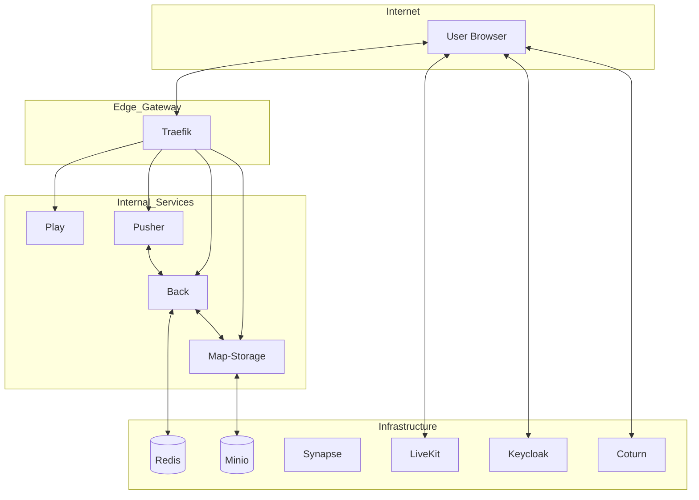

# مشخصات فنی و معماری زیرساخت پلتفرم دیجی‌ورک (Digiwork)
## سند جامع ارائه فنی - نسخه ۲.۵.۰ (فوریه ۲۰۲۶)

---

## ۱. مقدمه و چشم‌انداز پلتفرم
دیجی‌ورک یک راهکار سازمانی پیشرفته برای ایجاد **فضاهای کار مجازی (Virtual Workspaces)** و محیط‌های همکاری از راه دور در بستر متاورس دوبعدی است. این پلتفرم با تمرکز بر تعاملات انسانیِ مبتنی بر جابجایی فضایی (Spatial Interaction)، تجربه حضور در یک دفتر فیزیکی را در دنیای دیجیتال بازسازی می‌کند. زیرساخت این پلتفرم بر پایه معماری میکروسرویس‌های توزیع‌یافته و پروتکل‌های ارتباطی بی‌درنگ (Real-time) بنا شده است.

---

## ۲. پشته تکنولوژی (Technology Stack)

در جدول زیر، تمامی تکنولوژی‌های کلیدی استفاده شده در هسته و لایه‌های جانبی پلتفرم لیست شده است:

| لایه | تکنولوژی‌های مورد استفاده | کاربرد اصلی |
| :--- | :--- | :--- |
| **زبان‌های برنامه‌نویسی** | TypeScript, Node.js, Go (LiveKit) | توسعه منطق سمت سرور و کلاینت |
| **رابط کاربری (UI)** | Svelte, HTML5, CSS3, Tailwind CSS | ساخت اجزای بصری و داشبوردهای مدیریتی |
| **موتور رندرینگ** | Phaser 3 | مدیریت تعاملات بصری و جابجایی در فضای ۲ بعدی |
| **ارتباطات آنی (RTC)** | WebRTC, WebSocket (Protobuf) | انتقال صدا، تصویر و داده‌های حرکتی با تأخیر نزدیک به صفر |
| **ارتباطات بین‌سرویسی** | gRPC (HTTP/2) | تبادل داده سریع و ایمن بین میکروسرویس‌ها |
| **پایگاه‌های داده** | Redis, PostgreSQL | ذخیره‌سازی وضعیت‌های آنی و داده‌های پایدار |
| **مدیریت هویت** | Keycloak (OIDC) | احراز هویت مرکزی و پروتکل‌های امنیتی ورود |
| **زیرساخت و ارکستراسیون** | Docker, Docker Compose, Traefik | مدیریت کانتینرها، مسیریابی و امنیت لبه شبکه |
| **مانیتورینگ و مشاهده‌پذیری** | Prometheus, Grafana, Sentry | پایش سلامت زیرساخت و ردیابی خودکار خطاها |

---

## ۳. معماری کلان و میکروسرویس‌ها

سیستم دیجی‌ورک از چندین میکروسرویس متخصص تشکیل شده که از طریق یک شبکه داخلی امن با یکدیگر در ارتباط هستند.

---

## ۴. بررسی تفصیلی سرویس‌های داخلی (Service Deep Dive)

| نام سرویس | نقش تخصصی در اکوسیستم | جزئیات فنی |
| :--- | :--- | :--- |
| **Workspace Engine (Back)** | مدیریت منطق فضای کار | پردازش قوانین حضور، مدیریت متغیرهای محیطی و هماهنگی بین مناطق مختلف از طریق gRPC. |
| **Collaborator Client (Play)** | رابط گرافیکی و تجربه کاربر | ارائه رابط بصری فضای کار، مدیریت آواتارها و تعاملات محلی با استفاده از Svelte و Phaser. |
| **Communication Bridge (Pusher)** | مدیریت اتصالات آنی | نگهداری هزاران اتصال WebSocket همزمان و تبادل پیام‌های Protobuf بین کلاینت و موتور اصلی. |
| **Asset Storage (Map-Storage)** | مدیریت نقشه‌ها و دارایی‌ها | ذخیره‌سازی و مدیریت نسخه‌های مختلف چیدمان دفاتر (Files TMX/JSON) و هماهنگی با ذخیره‌ساز S3. |
| **File Uploader** | مدیریت بارگذاری مستندات | سرویس اختصاصی برای آپلود امن تصاویر، آواتارها و دارایی‌های گرافیکی جدید به مخزن فایل. |

---

## ۵. زیرساخت‌های جانبی و سرویس‌های مجتمع (Integrations)

| سرویس جانبی | شرح عملکرد | چرا برای محیط حرفه‌ای ضروری است؟ |
| :--- | :--- | :--- |
| **LiveKit SFU** | مرکز مدیریت رسانه | فراتر از ارتباط دو طرفه؛ مدیریت کنفرانس‌های بزرگ و ضبط جلسات (Egress) را ممکن می‌سازد. |
| **Matrix (Synapse)** | زیرساخت گفتگو (Chat) | پروتکل باز و رمزنگاری شده برای پیام‌رسانی داخلی که پایداری و حریم خصوصی را تضمین می‌کند. |
| **Keycloak IAM** | مدیریت هویت و دسترسی | امکان اتصال به سیستم‌های Active Directory یا Google Workspace برای مدیریت متمرکز ورود کاربران. |
| **Coturn (STUN/TURN)** | تضمین اتصال شبکه | حل مشکل اتصال کاربرانی که پشت فایروال‌های سخت‌گیرانه شرکتی یا VPN هستند. |

---

## ۶. لایه‌های امنیتی و حفاظت از داده‌ها (Security Architecture)

امنیت در دیجی‌ورک یک رویکرد چندلایه است:

1.  **امنیت انتقال (Transit Security):** تمامی ترافیک ورودی از طریق Traefik با گواهینامه‌های SSL/TLS رمزنگاری می‌شود.
2.  **امنیت رسانه (WebRTC Privacy):** استفاده از پروتکل‌های **DTLS** برای تبادل کلید و **SRTP** برای رمزنگاری صدا و تصویر، مکالمات را کاملاً ضدشنود می‌کند.
3.  **امنیت لایه‌بندی داخلی (Network Isolation):** دیتابیس‌ها و سرویس‌های حساس در شبکه‌های ایزوله داکر قرار دارند و مستقیماً از اینترنت قابل دسترس نیستند.
4.  **کنترل دسترسی (RBAC):** نقش‌های کاربری (مدیر، ناظر، ویرایشگر) در توکن‌های JWT ذخیره شده و در سطح gRPC برای هر درخواست چک می‌شوند.

---

## ۷. مانیتورینگ، مقیاس‌پذیری و پایداری

- **مقیاس‌پذیری افقی (Horizontal Scaling):** امکان افزایش تعداد کانتینرهای Pusher برای پشتیبانی از ده‌ها هزار کاربر همزمان بدون افت کیفیت.
- **مشاهده‌پذیری (Observability):**
    - **Prometheus:** جمع‌آوری لحظه‌ای آمارهای مصرف منابع و تعداد کاربران فعال.
    - **Sentry:** پایش خودکار باگ‌های احتمالی در سمت همکاران و سرور برای رفع سریع مشکلات.
- **تضمین پایداری:** استفاده از کلاسترهای Redis جهت جلوگیری از تک‌نقطه شکست (Single Point of Failure) در لایه حفظ وضعیت.

---
*این سند جهت ارائه به تیم‌های فنی و مدیران ارشد تهیه شده است. تمامی حقوق برای پلتفرم دیجی‌ورک محفوظ است.*
