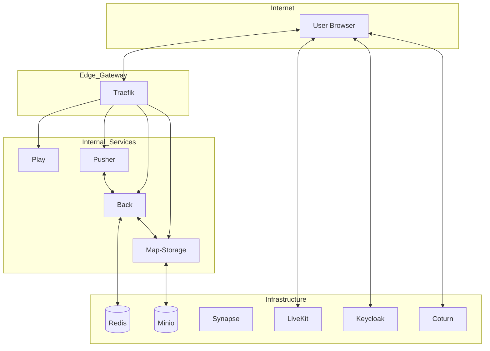

# Digiwork Platform: Professional Technical Specifications
## Comprehensive Infrastructure & Architecture Document - Version 2.5.0 (February 2026)

---

## 1. Executive Summary
Digiwork is a high-performance, scalable 2D Metaverse platform designed for remote collaboration, virtual offices, and immersive events. Built upon a robust microservices architecture, it leverages **WorkAdventure** technologies to provide real-time spatial audio/video, decentralized chat, and dynamic workspace synchronization. This document provides an exhaustive technical specification of the system's architecture, security model, API patterns, and infrastructure orchestration.

---

## 2. Technology Stack

The following table outlines the core technologies integrated into the Digiwork ecosystem:

| Layer | Technologies | Primary Purpose |
| :--- | :--- | :--- |
| **Languages** | TypeScript, Node.js, Go (LiveKit) | Core logic and backend service development |
| **Frontend UI**| Svelte, HTML5, CSS3, Tailwind CSS | Management dashboards and UI components |
| **Rendering Engine** | Phaser 3 | Spatial interaction and 2D environment rendering |
| **Real-Time Comm (RTC)** | WebRTC, WebSocket (Protobuf) | Sub-millisecond latency for media and spatial sync |
| **Inter-Service** | gRPC (HTTP/2) | High-performance internal service-to-service communication |
| **Databases** | Redis, PostgreSQL | Real-time state management and persistent data storage |
| **IAM** | Keycloak (OIDC) | Centralized identity management and OIDC security |
| **Infrastructure** | Docker, Docker Compose, Traefik | Containerization, edge routing, and SSL termination |
| **Observability** | Prometheus, Grafana, Sentry | Health monitoring and automated error tracking |

---

## 3. Higher-Level Architecture

### Service Mesh Topology
Digiwork operates as a distributed system of specialized microservices orchestrated via Docker. Traefik acts as the Edge Router, handling SSL termination, path-based routing, and load balancing across instances.

### Communication Protocols & API Layers
- **WebSocket (WSS)**: Primary real-time channel using **Protobuf** encoded messages (`ClientToServerMessage` / `ServerToClientMessage`) for spatial synchronization.
- **gRPC (HTTP/2)**: Low-latency service-to-service communication.
    - `WorkspaceManager`: Handles area logic, variable synchronization, and event dispatching.
    - `SpaceManager`: Manages multi-area "spaces" and cross-workspace state.
- **REST API**: Administrative endpoints, health checks (`/ping`), and Prometheus metrics (`/metrics`).
- **OIDC (OpenID Connect)**: Standardized identity layer for secure authentication via Keycloak.

---

## 4. Internal Service Deep Dive

| Service | Technical Role | Implementation Details |
| :--- | :--- | :--- |
| **Back (Workspace Engine)** | Core Logic Engine | Manages presence rules, environment variables, and cross-area coordination via gRPC. |
| **Play (Collaborator Client)** | UI & Rendering | Delivers the visual workspace experience using Svelte and Phaser 3. |
| **Pusher (Comm Bridge)** | Connectivity Manager | Maintains thousands of concurrent WebSockets; facilitates Protobuf messaging. |
| **Map-Storage (Asset Mgmt)** | Asset Orchestrator | Indexes TMX/JSON map files and synchronizes with S3-compatible storage. |
| **Uploader** | Media Ingress | Dedicated service for secure ingestion of images, avatars, and graphical assets. |

---

## 5. Third-Party Integrations

| Integration | Functional Description | Strategic Role |
| :--- | :--- | :--- |
| **LiveKit SFU** | Media Management | Orchestrates large-scale video conferencing and session recording (Egress). |
| **Matrix (Synapse)** | Chat Infrastructure | Decentralized, E2EE-capable messaging protocol for persistent workspace chat. |
| **Keycloak IAM** | Identity Provider | Supports LDAP/AD integration and MFA for enterprise-grade access control. |
| **Coturn (STUN/TURN)** | NAT Traversal | Guarantees connectivity for users behind restrictive corporate firewalls or VPNs. |

---

## 6. Security Architecture & Privacy

1.  **Transport Security**: All ingress traffic is secured via AES-256 SSL/TLS certificates managed by Traefik.
2.  **WebRTC Privacy**: Advanced media encryption using **DTLS** (handshake) and **SRTP** (media packets) ensures sub-millisecond, secure audio/video.
3.  **Network Isolation**: Core databases and state stores are locked within internal Docker networks, isolated from public routing.
4.  **RBAC**: Role-Based Access Control is enforced at the gRPC layer using JWT claims (Admin, Observer, Editor).

---

## 7. Scaling, HA & Observability

- **Horizontal Scaling**: The **Pusher** service is designed for horizontal growth to support massive concurrent user surges.
- **Observability**:
    - **Prometheus**: High-resolution time-series metrics for resource utilization.
    - **Sentry**: Real-time error monitoring and performance profiling for both client and server.
- **High Availability**: Redis clustering is employed to ensure the persistence layer remains resilient against single-node failures.

---
*Technical Document Version: 2.5.0 | Date: February 2026*
